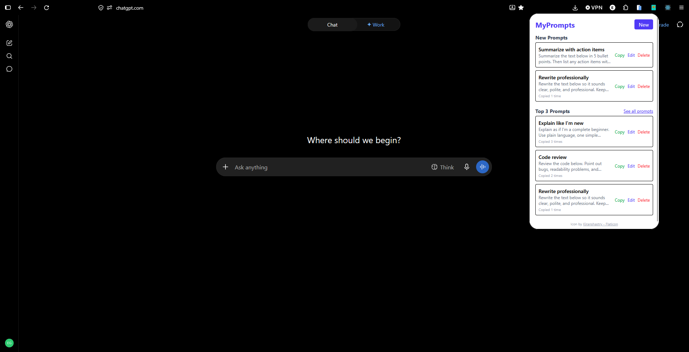
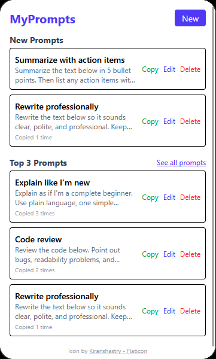

# 📓 MyPrompts

  

    
     
  <b>A browser extension for saving and reusing AI prompts.</b>

---

## 🚀 Try it!

  Get <a href="https://addons.mozilla.org/en-US/firefox/addon/myprompts-ai/">MyPrompts</a> for Firefox.

---

## About

MyPrompts is a **Firefox browser extension** designed to save and reuse AI prompts.

Users can create, view, edit, delete, search, and copy saved prompts for use with AI websites.

Prompts are stored locally using the WebExtensions storage API. The data belongs to the extension and is not stored on a remote server.

---

## 💾 Prompt Storage

MyPrompts uses **`chrome.storage.local`** to persist saved prompts.

Prompts are stored locally in the browser's extension storage and are separate from website cookies, cache, and browsing data.

### Prompts are preserved when:

* Closing the MyPrompts popup
* Closing browser tabs
* Restarting Firefox or browser
* Restarting the computer
* Reloading the extension
* Rebuilding the extension
* Clearing Firefox's cached web content
* Clearing website cookies and site data
* Clearing browsing history and downloads

### Prompts can be removed when:

* A prompt is manually deleted
* MyPrompts is uninstalled or removed
* Firefox is refreshed using **Refresh Firefox**
* The Firefox profile is deleted or reset
* Firefox data that includes extension storage is explicitly cleared
* The extension's identity is changed

There is currently no cloud synchronization or remote database. Prompts remain local to the browser installation.

---

## 🌐 Browser Support

MyPrompts is currently **exclusive to Firefox** as its primary supported browser.

The extension can also be used in **Google Chrome by manually importing/loading the extension**, although Chrome is not currently the primary supported browser.

---

## 🛠️ Tech Stack

### Frontend

* **Vite 8.3.2** — Frontend build tool
* **React.js 19.3.0** — UI library
* **TypeScript 7.0.2** — Type-safe JavaScript
* **Tailwind CSS 4.3.3** — CSS framework
* **@tailwindcss/vite 4.3.3** — Tailwind CSS integration with Vite

### Browser Extension

* **Firefox WebExtensions API** — Browser extension functionality
* **@types/chrome 0.3.4** — Extension API type definitions
* **`chrome.storage.local`** — Local storage for saved prompts

### Development

* **ESLint 10.12.0** — Code linting
* **@vitejs/plugin-react 6.1.1** — React integration with Vite

---

## Credits

<a href="https://www.flaticon.com/free-icons/gadget" title="gadget icons">Gadget icons created by Nikita Golubev - Flaticon</a>